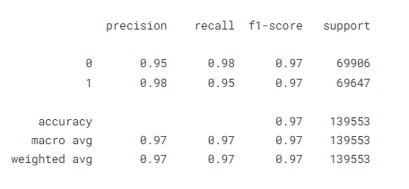
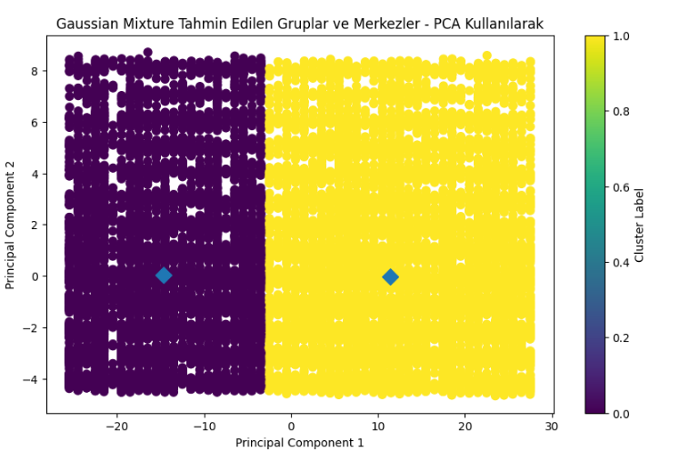

# Heart Disease Prediction
[Kaggle Notebook](https://www.kaggle.com/code/burhankorkmaz/hearth-disease-eda-supervised-unsupervised-models)
### Proje Amacı
Bu proje, kalp hastalığı verisi üzerinde Keşifsel Veri Analizi (EDA) ve hem denetimli hem de denetimsiz öğrenme tekniklerini kullanarak bir kişinin kalp krizi geçirip geçirmeyeceğini tahminlemeye çalışan bir makine öğrenmesi çalışmasıdır. Proje, veri temizleme, özellik seçimi, çeşitli makine öğrenimi algoritmalarının uygulanması ve sonuçların değerlendirilmesini kapsamaktadır. Amaç, kalp hastalığı riskini belirlemek ve sağlık hizmetlerini geliştirmek için kullanılabilir öngörüler sunmaktır.
### Veri Setinin Açıklanması
Bu veri seti, aşağıdaki sütunları içerir:

#### Sütunlar
- **State**: Hastanın yaşadığı eyalet.
- **Sex**: Hastanın cinsiyeti (Male: Erkek, Female: Kadın).
- **GeneralHealth**: Genel sağlık durumu (1-5 arası bir ölçek, 1 kötü sağlık durumunu, 5 mükemmel sağlık durumunu belirtir).
- **PhysicalHealthDays**: Son 30 günde fiziksel sağlık sorunları yaşanan gün sayısı.
- **MentalHealthDays**: Son 30 günde zihinsel sağlık sorunları yaşanan gün sayısı.
- **LastCheckupTime**: Son sağlık kontrolünden bu yana geçen süre (yıl olarak) 4 Farklı değer var.
- **PhysicalActivities**: Haftalık fiziksel aktivitelerin sıklığı (0: Yok, 1: Düşük, 2: Orta, 3: Yüksek).
- **SleepHours**: Günlük ortalama uyku süresi (saat cinsinden).
- **RemovedTeeth**: Eksik diş sayısı 4 farklı kategorik değer var.
- **HadHeartAttack**: Geçmişte kalp krizi geçirme durumu (0: Hayır, 1: Evet).
- **HadAngina**: Angina pektoris (göğüs ağrısı) durumu (0: Hayır, 1: Evet).
- **HadStroke**: İnme geçirme durumu (0: Hayır, 1: Evet).
- **HadAsthma**: Astım hastalığı durumu (0: Hayır, 1: Evet).
- **HadSkinCancer**: Cilt kanseri durumu (0: Hayır, 1: Evet).
- **HadCOPD**: Kronik Obstrüktif Akciğer Hastalığı (KOAH) durumu (0: Hayır, 1: Evet).
- **HadDepressiveDisorder**: Depresyon durumu (0: Hayır, 1: Evet).
- **HadKidneyDisease**: Böbrek hastalığı durumu (0: Hayır, 1: Evet).
- **HadArthritis**: Artrit durumu (0: Hayır, 1: Evet).
- **HadDiabetes**: Diyabet durumu 4 farklı kategorik değer var.
- **DeafOrHardOfHearing**: İşitme kaybı veya zorluk durumu (0: Hayır, 1: Evet).
- **BlindOrVisionDifficulty**: Körlük veya görme zorluğu durumu (0: Hayır, 1: Evet).
- **DifficultyConcentrating**: Konsantrasyon zorluğu durumu (0: Hayır, 1: Evet).
- **DifficultyWalking**: Yürüyüş zorluğu durumu (0: Hayır, 1: Evet).
- **DifficultyDressingBathing**: Giyinme veya banyo yapma zorluğu durumu (0: Hayır, 1: Evet).
- **DifficultyErrands**: Günlük işlerde zorluk durumu (0: Hayır, 1: Evet).
- **SmokerStatus**: Sigara içme durumu 4 farklı kategorik değer var.
- **ECigaretteUsage**: Elektronik sigara kullanımı 4 farklı kategorik değer var..
- **ChestScan**: Göğüs taraması durumu (0: Hayır, 1: Evet).
- **RaceEthnicityCategory**: Irk ve etnik köken kategorisi.
- **AgeCategory**: Yaş kategorisi (örn. 18-24, 25-34, vb.).
- **HeightInMeters**: Hastanın boyu (metre cinsinden).
- **WeightInKilograms**: Hastanın kilosu (kilogram cinsinden).
- **BMI**: Vücut kitle indeksi (BMI).
- **AlcoholDrinkers**: Alkol tüketme durumu (0: İçmiyor, 1: İçiyor).
- **HIVTesting**: HIV testi yapılıp yapılmadığı (0: Hayır, 1: Evet).
- **FluVaxLast12**: Son 12 ayda grip aşısı olup olmadığı (0: Hayır, 1: Evet).
- **PneumoVaxEver**: Hiç pnömokok aşısı olup olmadığı (0: Hayır, 1: Evet).
- **TetanusLast10Tdap**: Son 10 yıl içinde tetanos aşısı olup olmadığı 4 farklı kategorik değer var.
- **HighRiskLastYear**: Geçen yıl yüksek risk altında olma durumu (0: Hayır, 1: Evet).
- **CovidPos**: COVID-19 testi sonucu pozitif mi? 3 farklı kategorik değer var.

### **Performans Sonuçları**
#### **Denetimli Öğrenme**
Eğitim modellerin sonuçlarını incelediğimizde SMOTE tekniği ile veri artırımı yapılan modellerin doğruluk ve diğer değişkenler ile sonuçlarının veri azaltma yaptığım modellerden daha yüksek çıktığı görülmüştür.   
**SMOTE** uygulanmış veri ile elde edilen sonuçlar.  

  

 

**Random Under Sampling** uygulanmış veri ile elde edilen sonuçlar.  

  

 

**SMOTE** verisi ile en başarılı olan **XGBoost** modelinin sınıflandırma raporu ve karmaşıklık matrisi.  

  

  

 

**Random Under Sampling** verisi ile en başarılı olan **Random Forest** modelinin sınıflandırma raporu ver karmaşıklık matrisi.  

  

  

 

#### **Denetimsiz Öğrenme**

Denetimsiz öğrenmede veri setinin normal yani SMOTE ve RUS(Random Under Sampling) yöntemi kullanılmayan hali ve RUS uygulanan hali kullanılmıştır. SMOTE'un kullanılmama sebebi eğitim süreleri uzun sürdüğü için kullanmama kararı aldım.
 
Denetimsiz öğrenmede **Gaussian Mixture Model(GMM)** ve **K-Means** algoritmalarını kullandım. Ekstra olarak performans arttırmak için **PCA** yöntemi ile özellik seçimi yapıldı.  
Modellerin normal veri seti ile olan dağılım grafikleri aşağıda gösterilmiştir.  

  

  

 

Modellerin RUS veri seti ile olan dağılım grafikleri aşağıda gösterilmiştir.  

  

  

 

Sonuçlar incelendiğinde en başarılı modelin denetimli öğrenme modeli olan XGBoost olduğu ortaya çıkmaktadır.

 

 
